## Introduction
This document provides an exploratory analysis of the NEMSIS dataset. This dataset pertains to medical events. We begin our EDA by examining the data structure and then focus on missing values, as they play a crucial role in our data preprocessing. This project contains 7 python files, among which ComputedElment.py, eStuation09.py, eStuation10.py, eStuation11.py, eStuation12.py and PCRevent.py are used to preprocess the data and perform quick imputation according to the distribution of the column (mainly using mode for imputation). The Imputation.py implements the model to perform imputation on the remaining features. The selection of features refers to the [Cardiac Arrest Case Definition](reference/CardiacArrest.pdf) of NEMSIS V3.

## Setup and Requirements
*  Install miniconda 3 and R 4.3.2 to create reproducible environments for Python and R dependencies.

* Dependencies:
  - pandas=2.0.3
  - numpy=1.22.4
  - scikit-learn=0.24.2
  - matplotlib=3.4.3
  - rpy2=3.5.14 (Interface to R from Python, ensure R is installed)
  - scipy=1.9.1
  - seaborn=0.11.2

* Python and Libraries Installation
  ```
  pip install pandas==2.0.3
  pip install numpy==1.22.4
  pip install scikit-learn==0.24.2
  pip install matplotlib==3.4.3
  pip install rpy2==3.5.14
  pip install scipy==1.9.1
  pip install seaborn==0.11.2
  ```

* R and Libraries Installation
  ```
  install.packages("naniar")
  ```

* Dataset Preparation
  * Ensure to extract the dataset('processeddata.zip') in the folder of ASCII_2020 under the data folder when you run the script.

## Code Execution:
* Run the script using the commands to get the imputed dataset:
    ```
    python PCRevent.py
    ```
    ```
    python ComputedElement.py
    ```
    ```
    python eSituation09.py
    ```
    ```
    python eSituation10.py
    ```
    ```
    python eSituation11.py
    ```
    ```
    python eSituation12.py
    ```
    ```
    python Imputation.py
    ```
Please note that ComputedElment.py, eStuation09.py, eStuation10.py, eStuation11.py, eStuation12.py and PCRevent.py are used to read and preprocess the csv files in the original dataset, while imputation.py is used to merge these prepocessed tables, so Imputation.py needs to be run last.

* For MCAR test, please run the script:
  ```
  python MCAR.py
  ```
Please note that the MCAR test needs the filtered datasets of the above script(PCRevent.py and ComputedElement.py), make sure you run the MCAR test when you have filtered datasets.

* For the evaluation of our imputed datasets, please run the script:
  ```
  python Evaluation_Visualization.py
  ```
  ```
  python Evaluation_Model.py
  ```
Please note that the evaluation part needs the imputed datasets, make sure you have imputed datasets already.


## Data Structure
The NEMSIS dataset includes both continuous and categorical variables. We primary focus on these datasets:
* ComputedElements_CA.csv
* Pub_PCRevents_CA.csv
* FACTPCRPRIMARYIMPRESSION_CA.csv
* FACTPCRPRIMARYSYMPTOM_CA.csv
* FACTPCRSECONDARYIMPRESSION_CA.csv
* FACTPCRADDITIONALSYMPTOM_CA.csv


The ComputedElements_CA.csv includes the region, age, and EMS information of patients, the dataset contains 448683 rows and the dataset's head is:

| #  | Column                  |
|----|-------------------------|
| 0  | Unnamed: 0              |
| 1  | PcrKey                  |
| 2  | USCensusRegion          |
| 3  | USCensusDivision        |
| 4  | NasemsoRegion           |
| 5  | Urbanicity              |
| 6  | ageinyear               |
| 7  | EMSDispatchCenterTimeSec|
| 8  | EMSChuteTimeMin         |
| 9  | EMSSystemResponseTimeMin|
| 10 | EMSSceneResponseTimeMin |
| 11 | EMSSceneToPatientTimeMin|
| 12 | EMSTotalCallTimeMin     |


The Pub_PCREvents_CA.csv includes the patient's personal information and some medical records. You can refer to the [NEMSIS Data Dictionary](reference/NEMSISDataDictionary.pdf) for more details. The dataset contains 448683 rows and the dataset's head is:

| #  | Column          | 
|----|---------------- |  
| 0  | Unnamed: 0      |
| 1  | PcrKey          |
| 2  | eDispatch_01    |
| 3  | eDispatch_02    |
| 4  | eArrest_14      |
| 5  | eArrest_01      |
| 6  | eArrest_02      |
| 7  | eArrest_05      |
| 8  | eArrest_07      |
| 9  | eArrest_11      |
| 10 | eArrest_16      |
| 11 | eArrest_18      |
| 12 | eDisposition_12 |
| 13 | eDisposition_19 |
| 14 | eDisposition_16 |
| 15 | eDisposition_21 |
| 16 | eDisposition_22 |
| 17 | eOutcome_01     |
| 18 | eOutcome_02     |
| 19 | ePatient_13     |
| 20 | ePatient_15     |
| 21 | ePatient_16     |
| 22 | ePayment_01     |
| 23 | ePayment_50     |
| 24 | eResponse_05    |
| 25 | eResponse_07    |
| 26 | eResponse_15    |
| 27 | eResponse_23    |
| 28 | eScene_01       |
| 29 | eScene_06       |
| 30 | eScene_07       |
| 31 | eScene_08       |
| 32 | eScene_09       |
| 33 | eSituation_02   |
| 34 | eSituation_07   |
| 35 | eSituation_08   |
| 36 | eSituation_13   |
| 37 | eSituation_01   |
| 38 | eTimes_01       |
| 39 | eTimes_03       |
| 40 | eTimes_05       |
| 41 | eTimes_06       |
| 42 | eTimes_07       |
| 43 | eTimes_09       |
| 44 | eTimes_11       |
| 45 | eTimes_12       |
| 46 | eTimes_13       |
| 47 | eDisposition_17 |
| 48 | eDisposition_23 |


The FACTPCRPRIMARYSYMPTOM_CA.csv contains the primary sign and symptom present in the patient or observed by EMS personnel. You can refer to the [NEMSIS Data Dictionary](reference/NEMSISDataDictionary.pdf) for more details. The dataset contains 438358 rows and the dataset's head is:

| # |  Column        | 
|---|----------------|  
| 0 |  Unnamed: 0    |  
| 1 |  PcrKey        |  
| 2 |  eSituation_09 | 


The FACTPCRADDITIONALSYMPTOM_CA.csv contains other symptoms identified by the patient or observed by EMS personnel. You can refer to the [NEMSIS Data Dictionary](reference/NEMSISDataDictionary.pdf) for more details. The dataset contains 521362 rows and the dataset's head is:

| # |  Column        |
|---|----------------| 
| 0 |  Unnamed: 0    | 
| 1 |  PcrKey        | 
| 2 |  eSituation_10 |


The FACTPCRPRIMARYIMPRESSION_CA.csv contains the EMS personnel's impression of the patient's primary problem or most significant condition which led to
the management given to the patient (treatments, medications, or procedures).
. You can refer to the [NEMSIS Data Dictionary](reference/NEMSISDataDictionary.pdf) for more details. The dataset contains 429932 rows and the dataset's head is:

| #  | Column        | 
|----|---------------|  
| 0  | ID            |  
| 1  | PcrKey        |  
| 2  | eSituation_11 |


The FACTPCRSECONDARYIMPRESSION_CA.csv contains The EMS personnel's impression of the patient's secondary problem or most significant condition which led to the management given to the patient (treatments, medications, or procedures). You can refer to the [NEMSIS Data Dictionary](reference/NEMSISDataDictionary.pdf) for more details. The dataset contains 446186 rows and the dataset's head is:

| #  |  Column        | 
|----|----------------| 
| 0  |  Unnamed: 0    | 
| 1  |  PcrKey        | 
| 2  |  eSituation_12 |


### Graphical Representation

To visually represent the distribution of missing values, a bar graph can be helpful. Here's a representation:
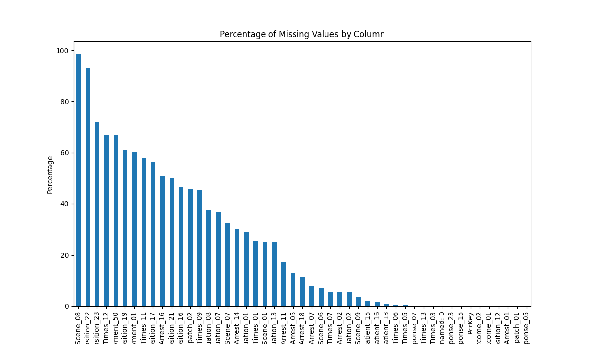


### Overview
From the output, we can  infer which columns have high percentages of missing values. Columns with more than 40% missing values were deemed to be less useful and were dropped. The missing percentages are shown below:

ComputedElements_CA.csv:

|Column                   |Missing Percentage |
|-------------------------|-------------------|
|Unnamed: 0               |  0.000000         |
|PcrKey                   |  0.000000         |
|USCensusRegion           |  0.121243         |
|USCensusDivision         |  0.121243         |
|NasemsoRegion            |  0.121243         |
|Urbanicity               |  2.883544         |
|ageinyear                |  1.955497         |
|EMSDispatchCenterTimeSec | 26.339027         |
|EMSChuteTimeMin          |  1.264587         |
|EMSSystemResponseTimeMin |  0.566100         |
|EMSSceneResponseTimeMin  |  0.703390         |
|EMSSceneTimeMin          | 45.556561         |
|EMSSceneToPatientTimeMin |  5.952296         |
|EMSTransportTimeMin      | 58.215804         |
|EMSTotalCallTimeMin      |  0.218862         |

Pub_PCREvents_CA.csv:

|Column          |Missing Percentage|
|----------------|------------------|
|Unnamed: 0      |  0.000000        |
|PcrKey          |  0.000000        |
|eDispatch_01    |  0.000000        |
|eDispatch_02    | 45.703435        |
|eArrest_14      | 30.357222        |
|eArrest_01      |  0.000000        |
|eArrest_02      |  5.347416        |
|eArrest_05      | 13.130845        |
|eArrest_07      |  7.987581        |
|eArrest_11      | 17.315081        |
|eArrest_16      | 50.768915        |
|eArrest_18      | 11.453272        |
|eDisposition_12 |  0.000000        |
|eDisposition_19 | 61.116510        |
|eDisposition_16 | 46.739130        |
|eDisposition_21 | 50.177185        |
|eDisposition_22 | 93.230202        |
|eOutcome_01     | 98.950709        |
|eOutcome_02     | 99.101149        |
|ePatient_13     |  0.905314        |
|ePatient_15     |  1.882171        |
|ePatient_16     |  1.723930        |
|ePayment_01     | 60.138093        |
|ePayment_50     | 67.076606        |
|eResponse_05    |  0.000000        |
|eResponse_07    |  0.000000        |
|eResponse_15    |  0.000000        |
|eResponse_23    |  0.000000        |
|eScene_01       | 25.218194        |
|eScene_06       |  7.081153        |
|eScene_07       | 32.528461        |
|eScene_08       | 98.594779        |
|eScene_09       |  3.536788        |
|eSituation_02   |  5.340284        |
|eSituation_07   | 36.741225        |
|eSituation_08   | 37.565859        |
|eSituation_13   | 24.952305        |
|eSituation_01   | 28.813820        |
|eTimes_01       | 25.511496        |
|eTimes_03       |  0.000000        |
|eTimes_05       |  0.309349        |
|eTimes_06       |  0.478733        |
|eTimes_07       |  5.454841        |
|eTimes_09       | 45.522461        |
|eTimes_11       | 58.072496        |
|eTimes_12       | 67.117838        |
|eTimes_13       |  0.002006        |
|eDisposition_17 | 56.238912        |
|eDisposition_23 | 72.033101        |

'eDispatch_02', 'eArrest_16', 'eDisposition_19', 'eDisposition_16', 'eDisposition_21', 'eDisposition_22', 'ePayment_01', 'ePayment_50', 'eScene_08', 'eTimes_09', 'eTimes_11', 'eTimes_12', 'eDisposition_17', and 'eDisposition_23'. Due to their substantial missing data, these columns were considered less useful for analysis and were subsequently dropped from the dataset. This decision was made to improve the quality and reliability of the data analysis, focusing on columns with more complete and therefore potentially more informative data.

In addition, these four tables FACTPCRPRIMARYIMPRESSION_CA.csv, FACTPCRPRIMARYSYMPTOM_CA.csv, FACTPCRSECONDARYIMPRESSION_CA.csv, FACTPCRADDITIONALSYMPTOM_CA.csv represent the specific symptoms and impressions of patients. Some patients have multiple patterns and some patients do not have specific patterns. Therefore, considering this situation , the missing values in these four tables are directly filled with 7701003(Not Recorded).

Also, eOutcome_01 and eOutcome_02 in Pub_PCREvents_CA.csv are related to the target we want to predict, so we decided to keep these two columns and fill the missing values with 7701003(Not Recorded).

eArrest_14 and eArrest_11 were considered for use but not chosen because, for this case definition, it is important to determine whether the cardiac arrest was due to a cardiac etiology. For more details, please look at [Cardiac Arrest Case Definition](reference/CardiacArrest.pdf). In addition, since ageinyear and ePatient_15 are duplicate columns, both represent age of patients, so we dropped ePatient_15.

After initial cleaning and imputation, the remaining columns would be imputed by specific methods. The merged dataset's head is:

| #  | Column                    |
|----|---------------------------| 
| 0  |  PcrKey                   | 
| 1  |  USCensusRegion           | 
| 2  |  USCensusDivision         | 
| 3  |  NasemsoRegion            | 
| 4  |  Urbanicity               | 
| 5  |  ageinyear                | 
| 6  |  EMSDispatchCenterTimeSec | 
| 7  |  EMSChuteTimeMin          | 
| 8  |  EMSSystemResponseTimeMin | 
| 9  |  EMSSceneResponseTimeMin  | 
| 10 |  EMSSceneToPatientTimeMin | 
| 11 |  EMSTotalCallTimeMin      | 
| 12 |  eDispatch_01             | 
| 13 |  eArrest_01               | 
| 14 |  eArrest_02               | 
| 15 |  eArrest_05               | 
| 16 |  eArrest_07               | 
| 17 |  eArrest_18               | 
| 18 |  eDisposition_12          | 
| 19 |  eOutcome_01              | 
| 20 |  eOutcome_02              | 
| 21 |  ePatient_13              | 
| 22 |  ePatient_16              | 
| 23 |  eResponse_05             | 
| 24 |  eResponse_07             | 
| 25 |  eResponse_15             | 
| 26 |  eResponse_23             | 
| 27 |  eScene_01                | 
| 28 |  eScene_06                | 
| 29 |  eScene_07                | 
| 30 |  eScene_09                | 
| 31 |  eSituation_02            | 
| 32 |  eSituation_07            | 
| 33 |  eSituation_08            | 
| 34 |  eSituation_13            | 
| 35 |  eSituation_01            | 
| 36 |  eTimes_01                | 
| 37 |  eTimes_03                | 
| 38 |  eTimes_05                | 
| 39 |  eTimes_06                | 
| 40 |  eTimes_07                | 
| 41 |  eTimes_13                | 
| 42 |  eSituation_09            | 
| 43 |  eSituation_10            | 
| 44 |  eSituation_11            | 
| 45 |  eSituation_12            |    


### Little's MCAR Test
Using Little's MCAR test, we can determine if the data is Missing Completely at Random. The result from our test on a sample of 40,000 records was:

|statistic | df    | p.value | missing.patterns | 
|----------|-------|---------|------------------|
|<dbl>     | <dbl> | <dbl>   | <int>            |
|90945.    | 56304 |  0      | 1517             |

The results of Little's MCAR test on our dataset, showing a test statistic of 90,945, degrees of freedom at 56,304, and a notably low p-value of 0, suggest a significant deviation from the Missing Completely at Random (MCAR) assumption. This implies that the missingness in your data is not occurring by chance and may be systematically related to other observed or unobserved data. The presence of 1,517 distinct missing data patterns indicates a complex structure in how data are missing, underscoring the need for careful consideration in choosing appropriate data imputation or handling techniques. Given these results, multiple imputation or model-based approaches can be explored to address the potential biases arising from the non-random missingness in subsequent analyses.


## Imputation Strategies
### Manual Imputation
* ePatient_13:
  * Definition: The patient's gender.
  * Method: Missing values were filled with a mixture of two categories ('9906003' and '9906001') in a 6:4 proportion.
  * Reason: This method was chosen to maintain the existing distribution of gender. It's implied that these proportions reflect the characteristic balance within the dataset.
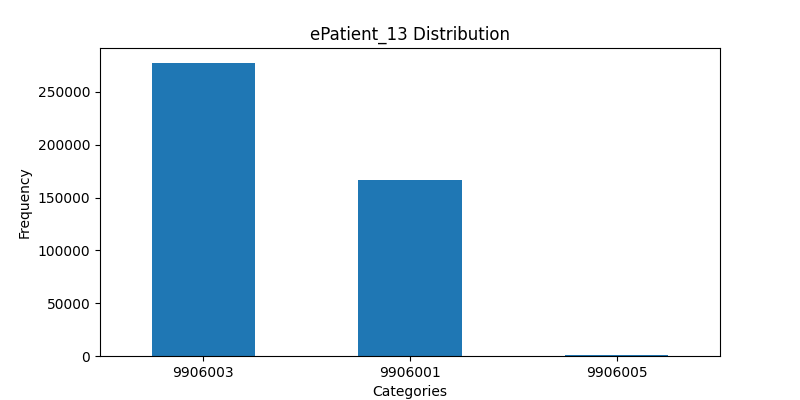

* ePatient_16, eScene_06, eScene_07:
  * Definition: 
    * ePatient_16: The unit used to define the patient's age.
    * eScene_06: Indicator of how many total patients were at the scene.
    * eScene_07: Indicator if this event would be considered a mass casualty incident (overwhelmed existing EMS resources).
  * Method: Missing values in these columns were filled with their respective mode.
  * Reason: The mode was used for imputation as it's a simple and effective way to maintain the existing distribution for categorical variables, particularly when the most common value is significantly more frequent than others.
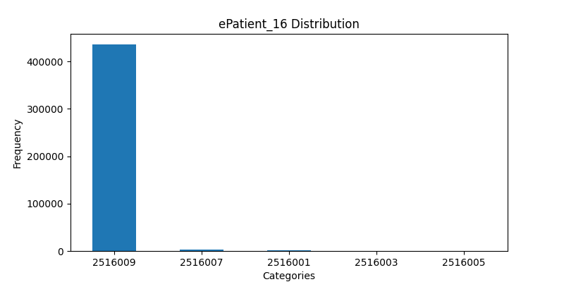
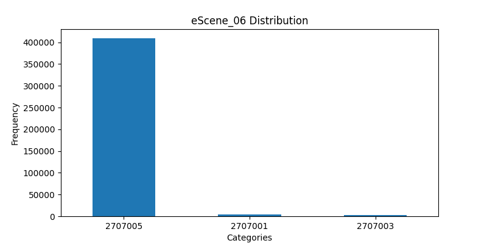
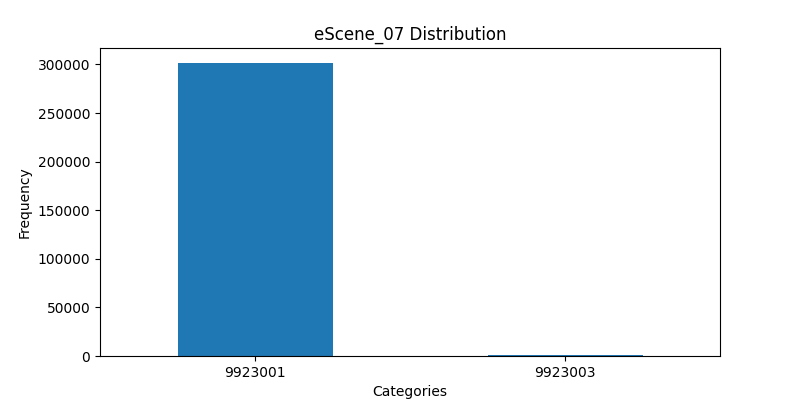

* eResponse_07:
  * Definition: The transport and equipment capabilities of the EMS Unit which responded to this specific EMS event.
  * Method: Similar to ePatient_16, eScene_06, and eScene_07, missing values were filled with the mode.
  * Reason: Given the very low percentage of missing values (only 0.009584%), filling in with the mode is a straightforward choice that minimally impacts the overall distribution of the data.
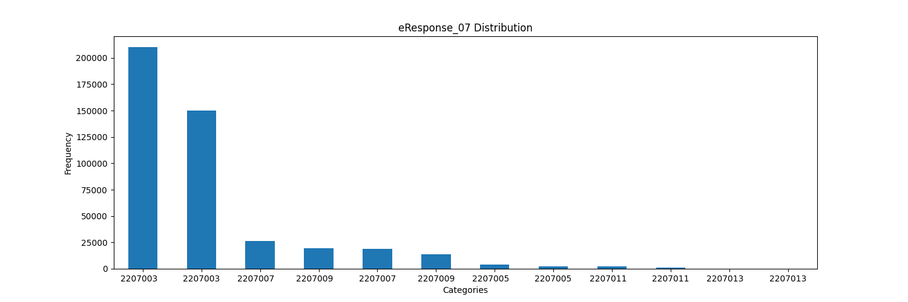

* eSituation_07 and eSituation_08:
  * Definition: 
    * eSituation_07: The primary anatomic location of the chief complaint as identified by EMS personnel.
    * eSituation_08: The primary organ system of the patient injured or medically affected.
  * Method: Missing values were filled proportionally based on the first and second modes. The filling was done such that the proportion of these two values in the imputed data matched their existing proportion in the non-missing data.
  * Reason: This approach was chosen to maintain the original distribution of the top two categories in these columns. It's particularly useful when the top two categories dominate the distribution.
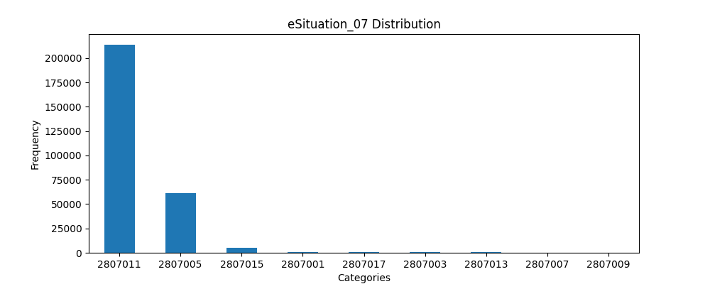
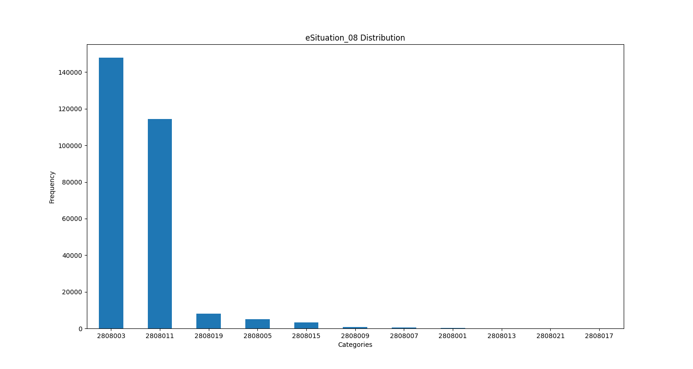

### Imputation Using MICE and Miss Forest

#### Continuous Data
* MICE (Estimator of Bayesian Ridge Regression):

  * Targeted at Continuous Data: In our dataset, MICE is applied specifically to continuous columns. These columns likely have intricate relationships with each other, where MICE's regression-based approach can effectively estimate missing values.
  * Iterative Updating: The method iteratively updates missing values in these continuous columns, leveraging the interdependencies among them. This is particularly beneficial given that dataset may contain complex, non-linear relationships.
  * Preserving Data Integrity: Given the nature of the dataset, MICE helps in preserving the statistical properties of the continuous variables, which is crucial for any subsequent analysis or modeling.
  * The columns of continuous data:

  ```
  continuous_data = ['ageinyear','EMSDispatchCenterTimeSec',
                        'EMSChuteTimeMin','EMSSystemResponseTimeMin',
                        'EMSSceneResponseTimeMin','EMSSceneToPatientTimeMin',
                        'EMSTotalCallTimeMin','eSituation_01', 'eTimes_01',
                        'eTimes_05', 'eTimes_06', 'eTimes_07','eTimes_13']
  ```
The continuous data encompasses a variety of columns that collectively provide a detailed timeline and demographic snapshot of EMS (Emergency Medical Services) events. "eSituation_01" captures the onset of symptoms as reported by patients or witnesses, marking the beginning of the medical incident. "eTimes_01" logs the moment the EMS dispatch center receives a call, initiating the emergency response. Following this, "eTimes_05" denotes when the EMS unit starts moving towards the incident, while "eTimes_06" and "eTimes_07" record the arrival times at the scene and the patient's side, respectively. The column "eTimes_13" signifies when the EMS unit concludes the call and is ready for another response, though not necessarily back at the base. Additionally, "ageinyear" provides the patient's age, a crucial demographic factor in emergency care.

The continuous data also includes specific metrics to evaluate the efficiency of the EMS response. "EMSDispatchCenterTimeSec" measures the dispatch center's processing time in seconds, whereas "EMSChuteTimeMin" calculates the time from call receipt to EMS departure. "EMSSystemResponseTimeMin" reflects the overall response time from the call to on-scene arrival. "EMSSceneResponseTimeMin" tracks the duration spent at the scene, vital for understanding on-site care efficiency. The time taken from arriving on the scene to reaching the patient is noted in "EMSSceneToPatientTimeMin." Lastly, "EMSTotalCallTimeMin" encompasses the entire duration of the EMS event, offering a comprehensive measure of the response from start to finish. These columns collectively provide crucial insights into the timelines and demographics of EMS events, essential for evaluating response efficiency and patient care.

#### Categorical Data
* Miss Forest (Estimator of Random Forest):

  * Focused on Categorical Data: Miss Forest was used to impute missing values in categorical columns. This choice is pertinent because Miss Forest excels in dealing with mixed-type data.
  * Random Forest Advantage: Leveraging the Random Forest algorithm, Miss Forest treats each missing value as a prediction problem, utilizing the other variables in the dataset as predictors. This is especially useful in the dataset where categorical variables might have complex relationships with other variables.
  * Capturing Complex Patterns: For the categorical variables in the dataset, capturing complex patterns and relationships is essential for accurate imputation. Miss Forest achieves this with its ensemble-based, non-linear modeling approach.

* MICE (Estimator of Logistic Regression):

  * Focused on Categorical Data: The Multiple Imputation by Chained Equations (MICE) approach, paired with a logistic regression estimator, was employed to impute missing values in categorical columns. This combination is particularly effective for categorical data due to the nature of logistic regression in handling classification tasks.

  * Logistic Regression Strength: Using logistic regression as the estimator within MICE turns each missing value into a multi-class classification problem, harnessing the relationships between variables in the dataset. This method is well-suited for datasets where categorical variables exhibit complex interdependencies.

  * Capturing Intricate Relationships: For categorical variables, accurately capturing intricate relationships and patterns is crucial for valid imputation. MICE, with logistic regression, effectively models these relationships in a probabilistic framework, allowing for nuanced imputations that respect the categorical nature of the data. This iterative method refines the imputations over multiple rounds, further enhancing the quality and reliability of the imputed values.

* Comparison:

  * Computational Demand: MissForest is more computationally intensive than MICE with logistic regression, making the latter a more scalable option for larger datasets.

  * Data Assumptions and Sensitivity: While MissForest is robust to outliers and distribution assumptions, MICE with logistic regression can be sensitive to outliers and requires the data to be either MCAR or MAR for optimal performance.

In summary, MissForest is preferable for our datasets with mixed types and non-linear patterns, while MICE with logistic regression is a computationally efficient choice for large datasets with categorical variables and simpler relationships.


  * The columns of categorical data:

  ```
  categorical_data = ['USCensusRegion','USCensusDivision','NasemsoRegion','Urbanicity',
                        'eArrest_02','eArrest_05','eArrest_07','eArrest_18',
                        'eScene_01', 'eSituation_02', 'eSituation_13']
  ```
  The dataset features several specific columns that detail various aspects of EMS (Emergency Medical Services) events. "eArrest_02" classifies the cause of cardiac arrest, distinguishing between cardiac and non-cardiac etiologies. "eArrest_05" records the use of Automated External Defibrillators (AED) before the arrival of EMS. The outcome of the patient at the end of the EMS event, encompassing aspects like survival or death, is captured in "eArrest_18". "eScene_01" indicates whether the EMS unit was the first responder on the scene among all agencies. Injuries associated with the EMS event are noted in "eSituation_02". The column "eSituation_13" assesses the acuity of the patient's condition when the EMS arrives, providing insights into the urgency and severity of each case.

  Additionally, the categorical data includes demographic and geographical information such as "USCensusRegion" and "USCensusDivision", which categorize the incident location into various regional divisions as defined by the U.S. Census. "NasemsoRegion" offers a broader geographical classification based on the National Association of State EMS Officials' regions, while "Urbanicity" describes the urban or rural nature of the incident location. These columns collectively paint a comprehensive picture of each EMS event, encompassing medical details, patient outcomes, response efficiency, and geographical demographics.

  Finally, all invalid columns have been dropped after imputation, such as negative age.


## Evaluation
### Imputed Distribution
* Distribution Plots for Categorical Data(MICE & Miss Forest Imputation):
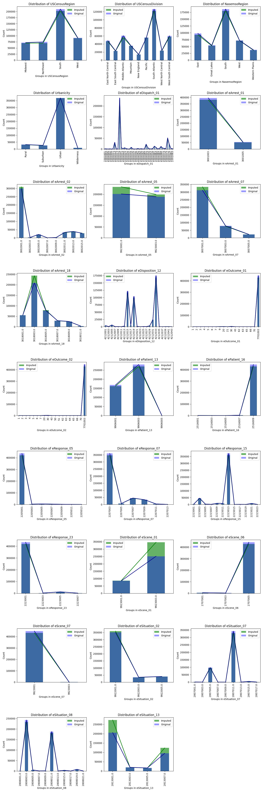

* Distribution Plots for Categorical Data(MICE Imputation):
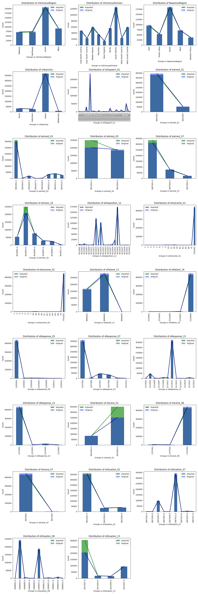

The distribution plots illustrate differences in the frequency of categories between the original and imputed datasets. In general, the imputed dataset should aim to maintain the same 
distribution shape as the original to preserve the data structure. Significant deviations could introduce bias or alter the relationships within the data. For the model-imputed categorical columns, the 
distribution almost follows the original distribution, there are relatively steeper lines of imputed distribution of eScene_01 and eSituation_13, but considering these two columns almost 
imputed by the mode, so the results are acceptable. It's worth noting that the imputed eArrest_05 by Miss Forest has a more aligned line than imputing by MICE eArrest_05 represents the documentation of the CPR provided before EMS arrival. It's a crucial feature in the further analysis. So Miss Forest has a better performance in this column. For other columns, the difference between the two methods of imputation datasets is too slight to visualize on the distribution chart, we need further analysis to quantify them.

* Density Plots for Continuous Data:
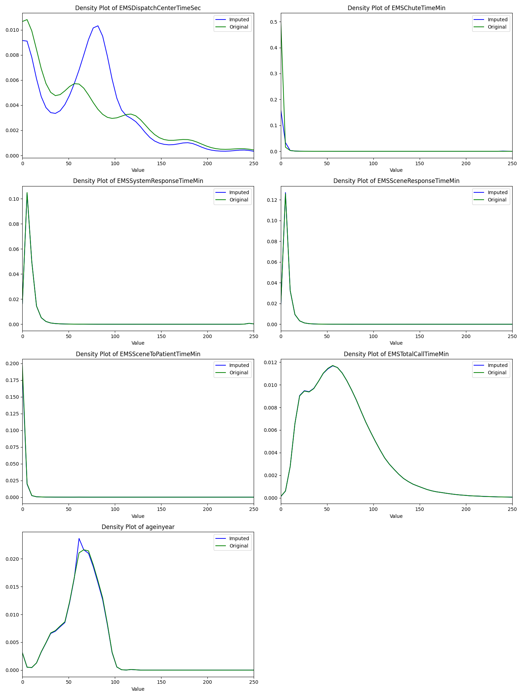

The density plots provide a visual comparison of the distribution of continuous variables. The key aspect to note is how closely the curves of the imputed data follow the original data. We aim to maintain the central tendency and dispersion (such as mean, variance) of the original data.

### Analysis
* Overlap of Curves:
  * For most variables, there is a strong overlap between the original and imputed density plots, suggesting the imputation has preserved the original distribution well.
  * In other cases, for example, the density plots for EMSDispatchCenterTimeSec and EMSChuteTimeMin indicate discrepancies between the original and imputed datasets. For EMSDispatchCenterTimeSec, the imputed data exhibit a shifted distribution, suggesting an alteration in the perceived dispatch efficiency, potentially biasing the dataset towards faster dispatch times. And EMSChuteTimeMin exhibit a narrow peak on imputed data. This may affect further statistical analyses and model performance.

* Peaks and Tails:
  * The peaks and tails align well, it shows that the most common values are consistent between datasets. And the tails suggest almost no changes in the range or variance.

* Shape of Distributions:
  * The shape of the distribution is crucial for categorical data. The imputed dataset almost aligns with the shape of the original dataset, as this can imply no changes or slight changes in the underlying data properties.
  * There are relatively steeper lines of imputed distribution of eScene_01 and eSituation_13, but considering these two columns almost imputed by the mode, so the results are acceptable.

* Key Variables:
  * Urbanicity: For Urbanicity, a categorical variable,  the proportions of urban versus rural incidents remain consistent after imputation. Any significant change could suggest a skew towards one type of setting, which could be misleading if urbanicity is a factor in outcome analysis.
  * Age: As a continuous variable, 'ageinyear' is critical for demographic analysis and may correlate with the outcome of EMS events. The density plot shows that the imputation has preserved the original distribution's shape and central tendencies (mean or median).
  * eArrest_18: This categorical variable indicates the outcome at the end of the EMS event, it's crucial that the imputation does not artificially inflate or deflate the prevalence of different outcomes. And its distribution remains consistent after imputation.
  * eArrest_05: It's worth noting that the imputed eArrest_05 by Miss Forest has a more aligned line than imputing by MICE eArrest_05 represents the documentation of the CPR provided before EMS arrival. It's a crucial feature in the further analysis. So Miss Forest has a better performance in this column.

### Impact of Imputation

#### Continuous Variables 
The focus is on how the central tendency and variability measures have changed due to imputation, and the KS test(Kolmogorov-Smirnov statistic) provides a measure of how the overall distribution has been affected. The result is shown below:

| Variable                 | Mean Difference    | Median Difference | Standard Deviation Difference | KS Statistic | P-value          |
|--------------------------|--------------------|-------------------|-------------------------------|--------------|------------------|
| ageinyear                | -0.0066            | 0.0               | -0.1957                       | 0.00999      | 1.036e-19        |
| EMSDispatchCenterTimeSec | -0.1612            | 22.5685           | -24.0321                      | 0.1597       | 0.0              |
| EMSChuteTimeMin          | 2.2273             | 0.0               | 22.2418                       | 0.0095       | 6.564e-18        |
| EMSSystemResponseTimeMin | -0.0098            | 0.0200            | 0.0133                        | 0.0012       | 0.8957           |
| EMSSceneResponseTimeMin  | -0.0032            | 0.0               | -0.0219                       | 0.0020       | 0.3052           |
| EMSSceneToPatientTimeMin | -0.0042            | 0.0300            | -0.1683                       | 0.0243       | 2.465e-112       |
| EMSTotalCallTimeMin      | 0.0129             | 0.0800            | 0.0991                        | 0.0009       | 0.9938           |

The statistical analysis for the continuous variables after imputation suggests that most changes are slight and within acceptable bounds, indicating that the imputation process has been relatively successful in preserving the original dataset characteristics.

* ageinyear: With only minimal changes in mean and standard deviation, and the KS statistic is relatively low, the overall impact on the age distribution is minor, making it acceptable for further analysis.

* EMSDispatchCenterTimeSec: There are noticeable differences in the median, and standard deviation, with the KS test showing a significant difference in distributions. The median has increased, which might indicate that the imputed data skews towards longer dispatch times, while the decrease in standard deviation suggests less variability in the imputed data. However, given the relatively small mean difference, this change might be deemed acceptable.

* EMSChuteTimeMin: The unchanged median and a slight increase in mean, paired with a low KS statistic, suggest a minor impact from imputation. And the increase in standard deviation reflects a correction of underrepresented variability in the original data, this could be acceptable.

* EMSSystemResponseTimeMin: The minuscule differences in mean, median, and standard deviation, combined with a non-significant KS statistic, indicate the imputation has not meaningfully altered this variable, making it acceptable.

* EMSSceneResponseTimeMin: The very slight changes and a non-significant KS statistic point to an acceptable level of alteration in the distribution due to imputation.

* EMSSceneToPatientTimeMin: Although the KS statistic is relatively high, the small mean difference and slight median increase suggest that the imputation has not dramatically changed the distribution, remaining within acceptable limits.

* EMSTotalCallTimeMin: The minimal changes in mean and median, with a non-significant KS statistic, suggest that the imputation is acceptable for this variable, with the distribution largely preserved.

Overall, the imputed data for these continuous variables show acceptable levels of change. The slight alterations still allow the imputed variables to reflect realistic and plausible values that align with the original data's structure, thereby maintaining the integrity of subsequent analyses.

#### Categorical Variables
Entropy calculations quantify the change in randomness or unpredictability in the categorical data distribution due to imputation. The result is shown below:

* Imputed by Miss Forest

| Variable         | Entropy Change            |
|------------------|---------------------------|
| USCensusRegion   | -0.0006388                |
| USCensusDivision | -0.0007168                |
| NasemsoRegion    | -0.0006903                |
| Urbanicity       | -0.0106003                |
| eDispatch_01     | -2.1614e-05               |
| eArrest_01       | 4.2810e-06                |
| eArrest_02       | -0.0276972                |
| eArrest_05       | -0.0028261                |
| eArrest_07       | -0.0297044                |
| eArrest_18       | -0.0641915                |
| eDisposition_12  | -1.7003e-05               |
| eOutcome_01      | -1.7870e-05               |
| eOutcome_02      | 6.0583e-06                |
| ePatient_13      | 3.9415e-06                |
| ePatient_16      | 5.9278e-06                |
| eResponse_05     | -1.9025e-05               |
| eResponse_07     | 5.9921e-06                |
| eResponse_15     | -2.2563e-05               |
| eResponse_23     | -1.7134e-05               |
| eScene_01        | -0.0662379                |
| eScene_06        | 8.3779e-06                |
| eScene_07        | 1.4269e-06                |
| eSituation_02    | -0.0152729                |
| eSituation_07    | 3.9864e-06                |
| eSituation_08    | 9.4857e-06                |
| eSituation_13    | -0.0623836                |

* Imputed by MICE

| Variable         | Entropy Change |
|------------------|----------------|
| USCensusRegion   | -0.0008881     |
| USCensusDivision | 0.0013952      |
| NasemsoRegion    | 0.0024339      |
| Urbanicity       | -0.0118515     |
| eDispatch_01     | 0.0068805      |
| eArrest_01       | 0.0007493      |
| eArrest_02       | -0.0368840     |
| eArrest_05       | -0.0116362     |
| eArrest_07       | -0.0341221     |
| eArrest_18       | -0.0801495     |
| eDisposition_12  | -0.0045891     |
| eOutcome_01      | 0.0020085      |
| eOutcome_02      | 0.0017809      |
| ePatient_13      | -0.0002051     |
| ePatient_16      | 0.0004920      |
| eResponse_05     | 0.0014719      |
| eResponse_07     | 0.0063337      |
| eResponse_15     | -0.0002656     |
| eResponse_23     | -0.0003927     |
| eScene_01        | -0.0769095     |
| eScene_06        | 0.0003060      |
| eScene_07        | 0.0002706      |
| eSituation_02    | -0.0200118     |
| eSituation_07    | 0.0023723      |
| eSituation_08    | 0.0025790      |
| eSituation_13    | -0.1364208     |


The entropy changes for the categorical variables after imputation reveal that most variables exhibit only slight alterations, indicating that the imputation process has generally preserved the original distributions well, making them acceptable for further analysis.

* Minimal Changes: Variables like USCensusRegion, USCensusDivision, NasemsoRegion, and eDispatch_01, eArrest_05 with very small entropy changes suggest that the imputation has effectively maintained the original randomness and information content. Such minimal changes imply that the imputation process has not significantly affected the variability or predictability of these variables.

* Moderate Changes: For Urbanicity, eArrest_02, eArrest_07, and eSituation_02, the entropy change, while moderate, is not substantial enough to deem the imputation unacceptable. These changes indicate a slight reduction in variability, but given their relatively small magnitude, the imputed data for these variables can still be considered reliable for most types of analysis.

* Relatively High Changes in Select Variables: Although eArrest_18, eScene_01, and eSituation_13 show larger negative changes in entropy, suggesting a reduction in variability, considering that the missing amount of these variables is not large, and most of the imputed values are the mode. It does not significantly impact the study outcomes, the imputed data still be acceptable.

* Slight Increases in Entropy: The slight increase in entropy for variables like eArrest_01, eOutcome_02, and others suggests a negligible increase in variability, which is generally acceptable and does not indicate a significant alteration in the distribution.

Comparison between MissForest and MICE:

* Variability Preservation: MissForest appears to preserve category variability better than MICE in certain variables. The negative entropy changes are generally less pronounced in Dataset 1 (MissForest), indicating that it maintains diversity to a greater extent.

* Consistency in Imputation: Both methods show consistency in the direction of entropy change across most variables, but the extent of change differs.

* Impact on Specific Variables: Certain variables like eArrest_18 and eSituation_13 show significantly more considerable entropy reductions with MICE, possibly implying that MICE is more likely to impute these missing values with the most frequent categories, leading to a more pronounced decrease in diversity.

In summary, while both MissForest and MICE effectively impute missing values in categorical data, their impact on the diversity or variability of these categories varies. MissForest tends to preserve more variability in the imputed data compared to MICE, which shows a tendency towards more significant reductions in category diversity for certain variables.

In conclusion, the entropy changes overall suggest that the imputation process has been largely successful, with the majority of the variables showing either negligible changes or changes that are within acceptable limits for maintaining the integrity of the dataset. The imputed data for these variables can, therefore, be considered suitable for further analysis, with the caveat that the few variables with more notable changes should be used cautiously depending on their role in the our specific analysis.
 
### Model Evaluation
In the model evaluation, four datasets were used, each with a distinct approach to handling missing values. This comprehensive evaluation allows for a nuanced understanding of how different imputation methods influence model accuracy. The eArrest_18 variable in the dataset is selected as the predicted  target which represents the patient's outcome after an Emergency Medical Services (EMS) event, particularly in cases of cardiac arrest or similar emergencies. It is a categorical variable with six distinct groups: "Expired in ED" (Emergency Department), indicating fatalities within the hospital; "Expired in the Field," for on-scene fatalities; "Ongoing Resuscitation in ED," where patients are still undergoing active resuscitation in the hospital; "ROSC in the Field" (Return of Spontaneous Circulation), denoting patients who revived before hospital arrival; "ROSC in the ED," for those who revived after reaching the hospital; and "Ongoing Resuscitation by Other EMS," indicating cases where patients received prolonged resuscitation from multiple EMS teams. This variable is crucial for evaluating the outcomes of EMS interventions and understanding the effectiveness of emergency response strategies.

* MICE and MissForest Imputed Dataset (Accuracy: 0.8042):

  * This dataset has the highest accuracy. The imputation strategy used here likely addressed the missing data more effectively than the simple mean/mode imputation. It suggests that the method used for imputing was better at preserving or reconstructing the underlying patterns in the data, leading to improved model performance.

* MICE-Only Imputed Dataset (Accuracy: 0.7973):

  * With an accuracy close to the combined MICE and MissForest imputation, this dataset shows that MICE alone is also an effective method for handling missing values. Its slightly lower accuracy compared to the combined method suggests that while MICE is powerful, integrating it with MissForest might capture additional nuances in the data.

* Simple-Imputed Dataset (Accuracy: 0.7321):

  * This dataset, where missing values in categorical columns were filled with modes and in continuous columns with means, shows the lowest accuracy. This result indicates that such a simple imputation approach might not adequately capture the complexity and relationships present in the data. Mean and mode imputation can sometimes oversimplify the data, leading to loss of variability and introduction of bias.

* Original Dataset (Accuracy: 0.7418):

  * The original dataset, which presumably contains missing values, has a lower accuracy than the fully imputed dataset. This outcome is expected as missing data can reduce the effectiveness of most predictive models. However, its accuracy is higher than the sample-imputed dataset, suggesting that the mean/mode imputation method may have introduced some inaccuracies or failed to capture the nuances in the data.

In summary, the evaluation highlights the superiority of advanced imputation methods (MICE and MissForest) in enhancing model accuracy, especially in comparison to basic imputation techniques or leaving the data with its original missing values. The nuanced differences between the datasets also reveal the importance of carefully selecting imputation strategies based on the dataset's characteristics and the model's requirements.

#### Factors Contributing to Differences:

* Preservation of Data Distribution: More sophisticated imputation methods can better preserve the original distribution and relationships within the data, which is crucial for the effectiveness of predictive models.

* Introduction of Bias: Simple imputation methods like mean/mode filling can introduce bias, especially if the missing data is not randomly distributed.

* Complexity of Relationships: If the dataset has complex relationships and interactions among variables, mean/mode imputation might oversimplify these relationships, whereas more advanced imputation techniques can better account for them.

In conclusion, the difference in accuracies reflects the effectiveness of the imputation methods in capturing and preserving the inherent patterns and relationships in the data. The results suggest that the method used for the fully imputed dataset was more successful in this regard compared to simple mean/mode imputation.

#### ROC Plots
The ROC plots for the sample-imputed, original, and model-imputed datasets provide valuable insights into the classification performance of the predictive model for each class in these datasets. Here are plots of three datasets:

* Simple-Imputed Dataset:
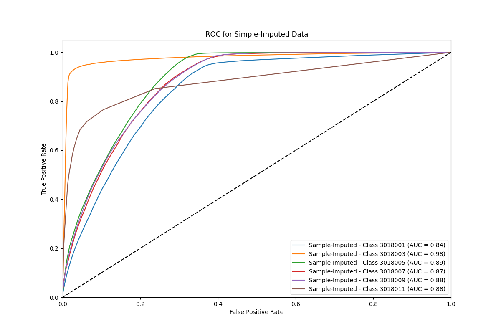

The curves suggest that the model has varying degrees of discriminative ability across different classes. Some classes (like Class 3018003) exhibit very high AUC scores close to 0.98, indicating excellent model performance. In contrast, other classes (like Class 3018001) have lower AUC scores, implying a lower true positive rate at the same false positive rate levels. Overall, the model shows good performance on the imputed data, but there is room for improvement in certain classes.

* Original Dataset:
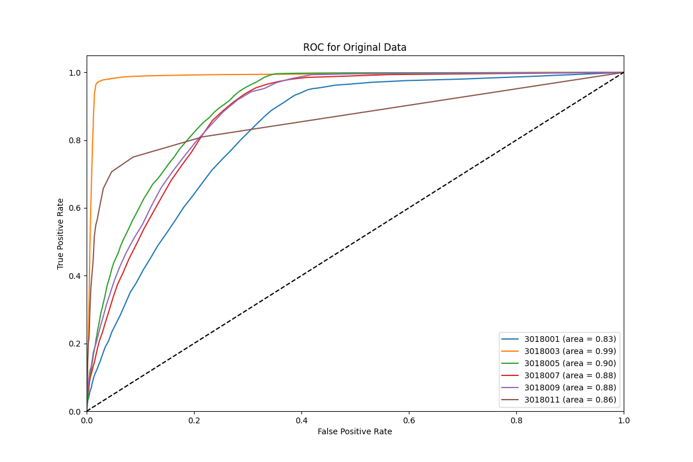

The ROC curves for the original dataset show that the model performs well, with some classes reaching AUC scores of 0.99. This high performance might be due to the model learning from the actual, although incomplete, data distribution without any imputation bias. However, the performance is not uniform across all classes, which is typical in multiclass classification problems.

* Model-Imputed Data (MICE & Miss Forest):
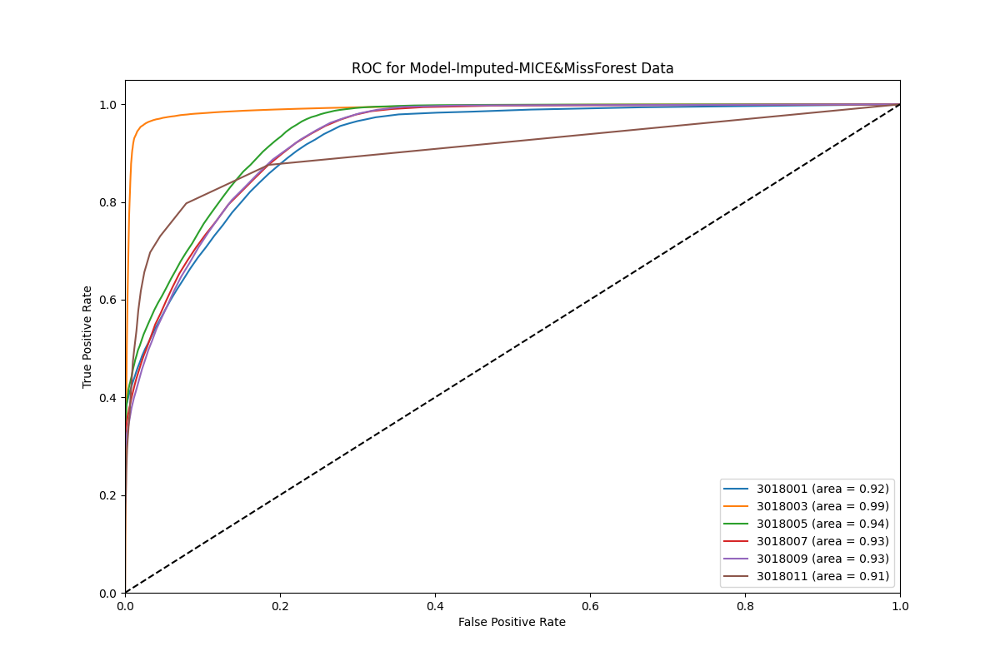

The ROC curves for the model-imputed dataset generally exhibit high AUC scores, with most of them over 0.90, which indicates a strong predictive performance. This suggests that the imputation technique used here might be well-suited for the dataset, preserving important relationships and allowing the model to generalize well.

* Model-Imputed Data (MICE):
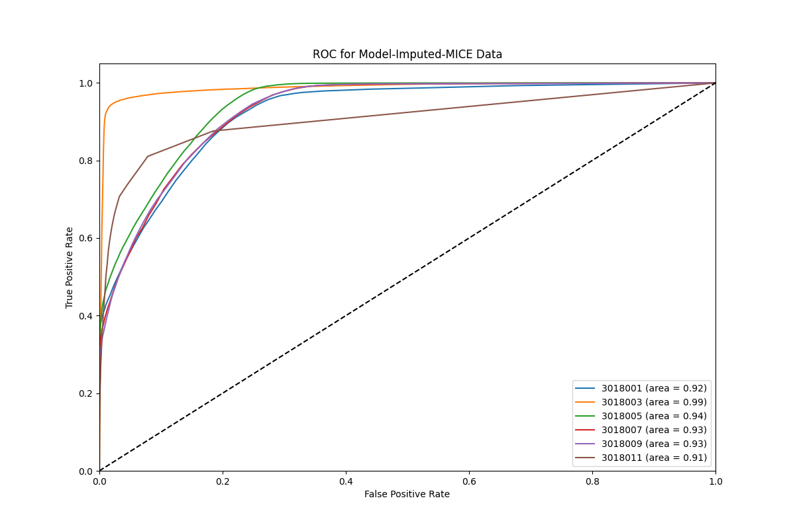

The ROC curve for the dataset imputed with MICE alone also demonstrates high area under the curve (AUC) values as combined MICE & MissForest imputation dataset, suggesting strong predictive capabilities. Both methods provide robust predictions, as indicated by their respective ROC curves lying significantly above the diagonal line of no-discrimination.


We mainly evaluate the ROC curve from the following points:

* Consistency in Model Performance: The model exhibits consistent predictive ability across the imputed and original datasets, as indicated by the high AUC scores. This is a sign of robustness in the model's ability to classify observations correctly across different data treatments.

* Imputation Effectiveness: The effectiveness of the imputation method can be inferred from the AUC scores. Higher AUC scores in the model-imputed dataset compared to the sample-imputed dataset suggest that the imputation method used for the model-imputed data is capturing the underlying data distribution more effectively.

* Trade-Offs in Imputation: The trade-offs between different imputation methods become evident when comparing the curves. While the simple imputation might lead to lower performance in some classes, it can still perform relatively well overall, which could be acceptable depending on the application and the importance of each class for the further analysis.

In summary, the AUC values across different classes and datasets indicate that while the model performs well in general, the choice of imputation strategy can have significant effects on the performance for certain classes. This implies the importance of choosing an appropriate imputation method that aligns with the underlying data structure and the goals of the analysis.

## Result
In assessing the four datasets for further analysis, the combined MICE & MissForest imputed dataset emerges as the most suitable choice. It not only showcases the highest accuracy but also superior ROC curve metrics, suggesting an enhanced ability to distinguish between classes. The minimal entropy changes and the maintenance of the original data's distribution underscore its capability to preserve data diversity, which is vital for in-depth analytical work.

However, it's important to consider computational efficiency, particularly for large datasets or when resources are constrained. Although the combined MICE & MissForest method is more accurate, it is also more resource-intensive. In contrast, the MICE-only imputed dataset offers a compromise with slightly reduced accuracy but increased computational efficiency. It still effectively retains the original distribution of the data, as indicated by the entropy changes and distribution charts.

Balancing accuracy with computational demands, the MICE-only imputed dataset is recommended for further analysis when computational resources are limited. This approach streamlines the workload without significantly compromising the quality of the predictive modeling, making it a pragmatic option for large-scale data environments.


