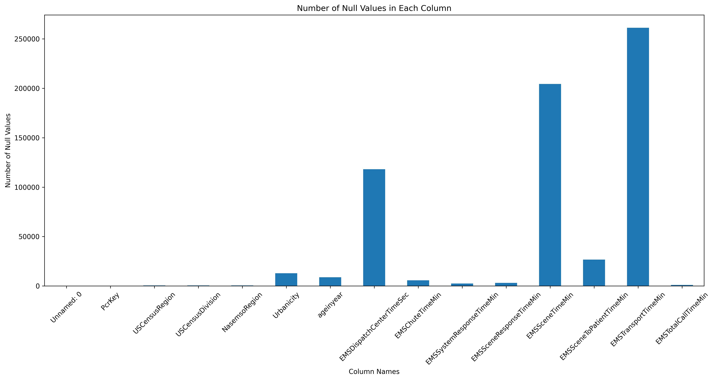

### Story
The healthcare landscape is ever-evolving, and in this wave of advancements, predicting patient outcomes has gained unparalleled importance. Critical Care Doctors at MaineHealth aim to harness data insights from cardiac arrest patients in the ICU to pinpoint determinants that influence either good or poor outcomes. A key resource for this investigation is the National Emergency Medical System (NEMSIS) database, which is a vast repository of nationwide 911 calls. With the dataset's breadth, our primary focus will be a sampled version that zeroes in on cardiac arrest cases to delve into the nuances of "rurality" and its implications. This initiative is not an isolated one; it builds upon a foundation laid by previous research endeavors.

### Approach
* The core objective of this project is to amalgamate data analytics with clinical insights, aiming to unveil patterns, trends, and potential determinants that can forecast cardiac arrest outcomes in ICU patients by urbanicity/rurality. More specifically:

  * We aim to perform a detailed and reproducible exploratory data analysis.
  * Appraise different data imputation methodologies, primarily focusing on MICE and MissForest.
  * Set the groundwork for subsequent modeling of prediction of cardiac arrest patients' outcomes are good or poor.

* There's the potential challenge of data granularity, missing data points, and the intricacies of dealing with real-world clinical data. Another risk factor is ensuring that data interpretations align with clinical realities.

* Besides the established methodologies, we propose to integrate data imputation techniques to better manage gaps in data. This approach is hoped to enhance the dataset's integrity and the veracity of our findings.

### EDA

1. Setup and Requirements:
    * Ensure you have Python and the required libraries installed:
      
     ```
     pip install pandas matplotlib numpy
     ```

    * Ensure to extract the dataset('processeddata.zip') in the folder of ASCII_2020 under the data folder when you run the script.

 2. Code Execution:
    * Run the script using the command:
     ```
     python proposal_null_values.py
     ```

3. Output:
   * After execution, the script will generate a bar chart visualizing the number of null values in each column of the dataset.
   * A saved image "null_values_chart.jpg" with this visualization will be available in the same directory. You can view this image using any image viewer or even upload it to a platform of your choice.
